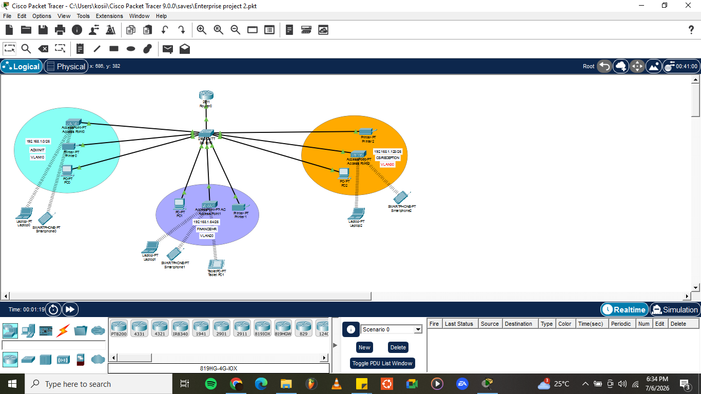
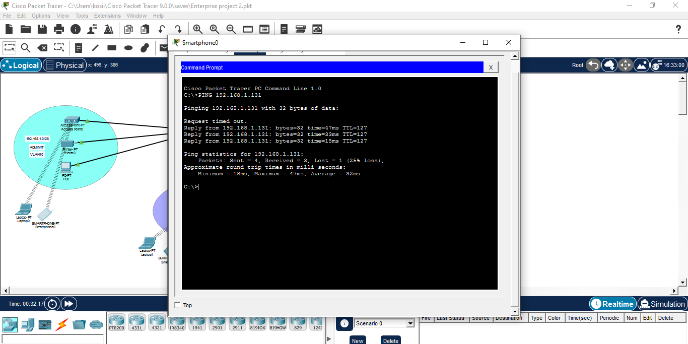
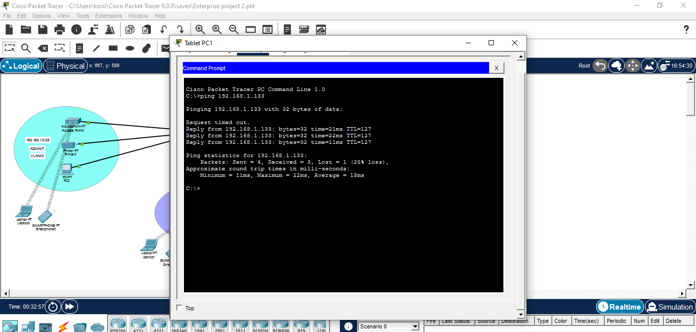

# Cisco SOHO Network Design & Implementation

## Overview

This project demonstrates the design and implementation of a Small Office/Home Office (SOHO) network using Cisco Packet Tracer.

The objective was to design a secure and scalable branch office network for ABC Company that provides network segmentation, wireless connectivity, automatic IP address allocation, and communication between all departments.

The project was completed from initial network planning through implementation, testing, and verification using Cisco IOS.

---

# Network Topology



---

# Project Scenario

ABC Company is opening a new branch office in Bonalbo, Australia.

The new office must operate independently from the headquarters while supporting three business departments.

The design requirements included:

- One Cisco Router
- One Cisco Layer 2 Switch
- Three separate VLANs
- Wireless access for each department
- Automatic IP Address allocation
- Full communication between all departments

---

# Departments

| VLAN | Department |
|------|------------|
| VLAN 10 | Admin / IT |
| VLAN 20 | Finance / HR |
| VLAN 30 | Customer Service / Reception |

---

# Network Design

The network was designed using:

- Cisco 2911 Router
- Cisco 2960 Switch
- Three Wireless Access Points
- PCs
- Laptops
- Smartphones
- Network Printer

The implementation uses **Router-on-a-Stick** to provide routing between VLANs.

---

# Subnetting Design

Base Network Provided

```
192.168.1.0/24
```

Since three departments were required, the network was subnetted into **/26 networks**.

Subnet Mask

```
255.255.255.192
```

Block Size

```
64
```

### VLAN 10 - Admin / IT

| Item | Address |
|------|---------|
| Network ID | 192.168.1.0/26 |
| Default Gateway | 192.168.1.1 |
| First Host | 192.168.1.1 |
| Last Host | 192.168.1.62 |
| Broadcast | 192.168.1.63 |

---

### VLAN 20 - Finance / HR

| Item | Address |
|------|---------|
| Network ID | 192.168.1.64/26 |
| Default Gateway | 192.168.1.65 |
| First Host | 192.168.1.65 |
| Last Host | 192.168.1.126 |
| Broadcast | 192.168.1.127 |

---

### VLAN 30 - Customer Service

| Item | Address |
|------|---------|
| Network ID | 192.168.1.128/26 |
| Default Gateway | 192.168.1.129 |
| First Host | 192.168.1.129 |
| Last Host | 192.168.1.190 |
| Broadcast | 192.168.1.191 |

---

# Technologies Used

- Cisco Packet Tracer
- VLAN Configuration
- Inter-VLAN Routing
- Router-on-a-Stick
- DHCP
- Wireless LAN
- IPv4 Subnetting
- Trunk Ports
- Cisco IOS
- Network Troubleshooting

---

# Configuration Highlights

## Switch

Configured:

- VLAN 10
- VLAN 20
- VLAN 30
- Access Ports
- 802.1Q Trunk Port

Configured:

- Router-on-a-Stick
- Subinterfaces
- DHCP Pools
- Default Gateways
- Inter-VLAN Routing

# DHCP Configuration

Each VLAN receives IP addresses automatically from the router.

Separate DHCP pools were configured for:

- Admin / IT
- Finance / HR
- Customer Service

---

# Wireless Configuration

Each department has its own wireless network using a dedicated Cisco Access Point.

Wireless clients successfully receive IP addresses via DHCP and communicate across VLANs.

---

# Testing & Verification

The following tests were successfully completed:

- VLAN verification
- DHCP lease verification
- Trunk verification
- Inter-VLAN routing
- End-to-End Ping Tests
- Wireless client connectivity
- Printer communication
- Gateway reachability

---

# Ping Results





---

# Skills Demonstrated

This project demonstrates practical knowledge of:

- Network Design
- IPv4 Subnetting
- VLAN Configuration
- Cisco Switching
- Cisco Routing
- Router-on-a-Stick
- DHCP Configuration
- Wireless Networking
- Network Troubleshooting
- Cisco IOS CLI

# Author

**Isuma Chiemelie Kosi**

Network Engineer | Cisco | Routing & Switching | Network Automation | Python | Ansible | Network Security
